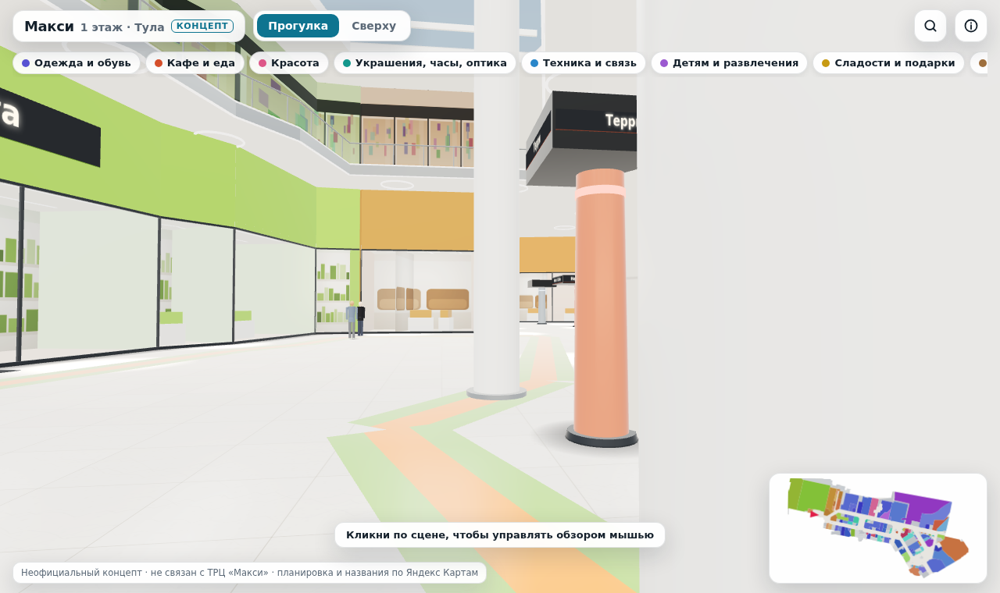
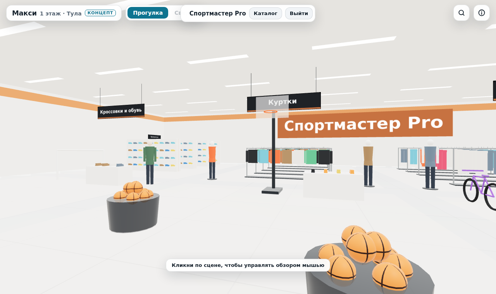
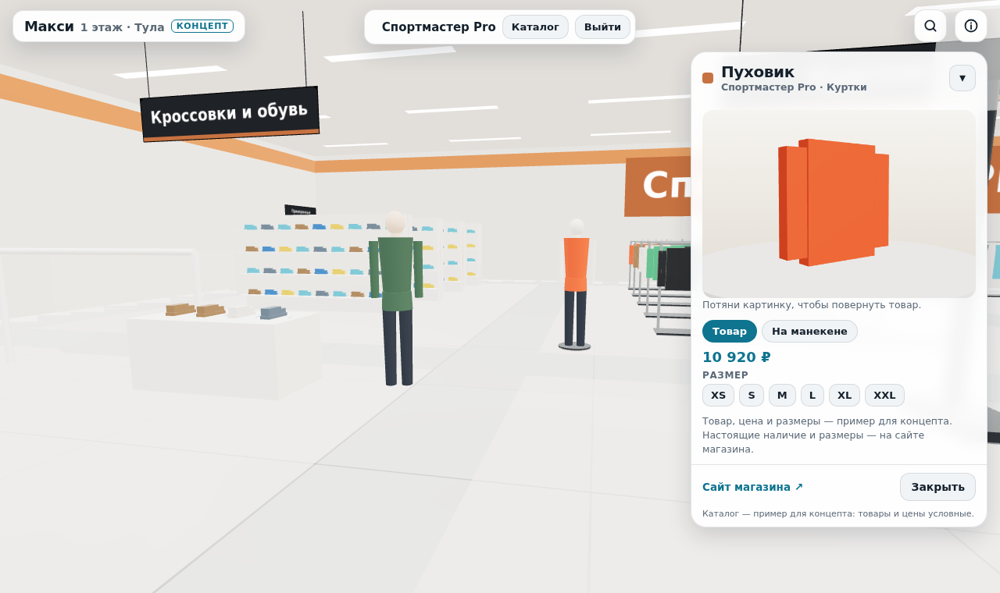
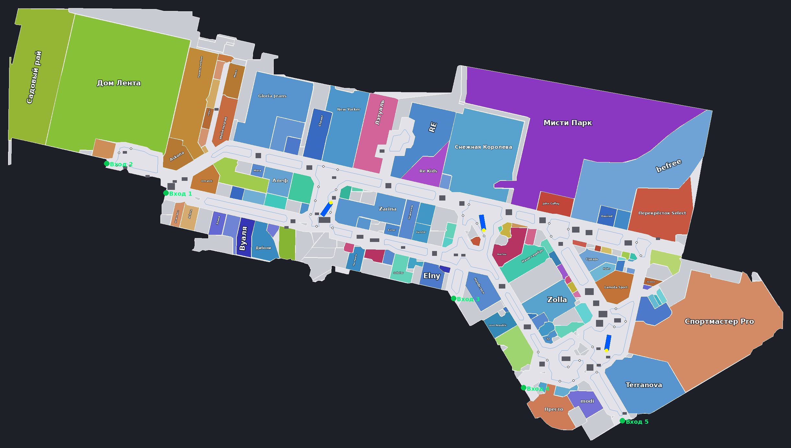

# Прогулка по Макси

Неофициальный концепт: 3D-прогулка по ТРЦ «Макси» (Тула, ул. Пролетарская, 2) — для тех, кто не может прийти лично. По двум этажам галереи можно ходить, ездить на лифте, заходить в магазины, кино и фуд-корт, смотреть товары со всех сторон и на манекене, класть их в корзину и оформлять заказ (демо). Проект не связан с ТРЦ «Макси» и его арендаторами. Товары и цены в каталоге условные.



| Зал Спортмастера | Страница товара | Раскладка сверху |
|---|---|---|
|  |  |  |

## Быстрый старт

Нужен Node.js 18 или новее.

```bash
npm install
npm run dev          # откроется http://localhost:5173
```

Проверка в настоящем браузере (скриншоты и поиск ошибок):

```bash
npx playwright install chromium   # один раз
npm run dev                       # в первом терминале
npm run check                     # во втором: скриншоты окажутся в tools/test/out/
# если браузер Playwright не находится: CHROME_PATH=/путь/к/chrome npm run check
```

Сборка для выкладки на хостинг: `npm run build`. Готовый сайт появится в папке `dist/`.

## Как продолжить в Claude Code

1. Распакуй архив и открой папку проекта в терминале.
2. Установи зависимости: `npm install`.
3. Запусти `claude`. Инструкции для него лежат в `CLAUDE.md`, он прочитает их сам.
4. Первые задачи можно дать, например, такие:
   - «Прочитай CLAUDE.md, запусти проект и `npm run check`, покажи скриншоты».
   - «Разбей src/app.js на модули по плану из CLAUDE.md, после каждого шага проверяй `npm run check`».
   - «Подключи настоящие 3D-модели (GLB) для кроссовок и курток в Спортмастере».

## Управление

- **Компьютер.** Кликни по сцене: курсор скроется, и обзор пойдёт за мышью. WASD или стрелки — идти, Shift — быстрее. Клик по магазину или товару открывает окно, курсор при этом появляется сам. Esc возвращает курсор.
- **Телефон.** Джойстик слева внизу — идти, проведи по экрану — осмотреться.
- **Двери магазинов** открываются, когда подходишь. Просто пройди в проём, и ты внутри. Выход — через те же двери.
- **Вид сверху** (кнопка «Сверху» или V): каждое помещение своим цветом с подписью. Нажми на коридор — появится «Перейти сюда».
- **Этажи**: кнопки «1» и «2» вверху (или клавиши 1 и 2) либо лифт — подойди к дверям, панель с этажами откроется сама. Лифты стоят там, где они на официальной схеме ТРЦ.
- **Покупки**: на странице товара выбери размер, «В корзину» или «Купить сейчас». Корзина — кнопка с сумкой. Заказ демонстрационный, никуда не отправляется.
- **Без анимации**: переключатель в окне «О проекте» (кнопка i). Включается сам, если в системе стоит «уменьшить движение».
- **Телефон** работает вертикально и горизонтально.

## Структура

```
index.html               разметка интерфейса (панели, карточка, каталог)
src/main.js              точка входа
src/app.js               сцена галереи, управление, лифты, магазины изнутри (пока один модуль)
src/floor2.js            второй этаж: помещения, арендаторы, лифты со схемы ТРЦ
src/shop/catalog.js      отделы магазинов, демо-товары, ссылки на сайты сетей
src/shop/describe.js     описание и характеристики товара для карточки
src/shop/cart.js         корзина (хранится в браузере)
src/shop/icons.js        картинки товаров для карточек
src/utils.js             общие помощники
src/style.css            стили интерфейса
src/data/maxi-data.json  данные карты: помещения, коридоры, островки, эскалаторы, входы
tools/pipeline/          скрипты, которые строят maxi-data.json из скриншотов Яндекс Карт
tools/test/check.mjs     проверка в браузере
docs/standalone/         прежняя версия одним HTML-файлом, как она была в артефакте
docs/screenshots/        скриншоты
```

## Откуда взялась карта

Планировка собрана из четырёх скриншотов Яндекс Карт первого этажа (`tools/pipeline/source/y*.png`). Их склеили в одну карту по совпадающим названиям магазинов и разделили на помещения, коридоры и островки. Северные части самых больших помещений, которых нет на скриншотах, достроены по официальной схеме ТРЦ (`plan.png`). Масштаб взят по линейке карт.

Дальше скрипты выпрямляют стены по основным осям здания и расширяют коридоры примерно на 30%. Колонны ставятся только в атриумах, эскалаторы — в центрах атриумов, с проходом не меньше 2 м. В конце проверяется, что весь этаж связан и до каждого магазина можно дойти.

Пересобрать данные:

```bash
pip install -r tools/pipeline/requirements.txt
npm run map
```

Скрипт полностью детерминированный: из тех же скриншотов он получает тот же файл.

## Что известно и что дальше

- Товары, цены и размеры — примеры. Картинки товаров и 3D-модели собраны из простых фигур.
- 38 помещений без подписи на картах показаны серыми. У шести мелких точек нет своей витрины и входа.
- Второй этаж: арендаторы настоящие (по 2ГИС и сайту ТРЦ), но точной схемы этажа в открытых источниках нет. Помещения повторяют контуры первого этажа, места магазинов примерные. Чтобы сделать точно, нужны скриншоты второго этажа с Яндекс Карт — их можно прогнать через тот же конвейер.
- Заказ — демо: корзина и форма работают, но заказ не уходит в магазины.
- `src/app.js` — большой модуль, его стоит разбить на части (план в `CLAUDE.md`).
- Three.js закреплён на версии 0.128.0: код использует её API. Переход на свежую версию описан в `CLAUDE.md`.

Следующие шаги:

1. Разбить код на модули.
2. Настоящие 3D-модели товаров (GLB).
3. Реальные товары из фидов магазинов (YML через партнёрские сети) и ссылки прямо на товар.
4. Точная схема второго этажа по скриншотам Яндекс Карт.
5. Настоящий заказ: бэкенд или переход в корзину сайта сети.
6. Упаковка в Telegram Mini App.
